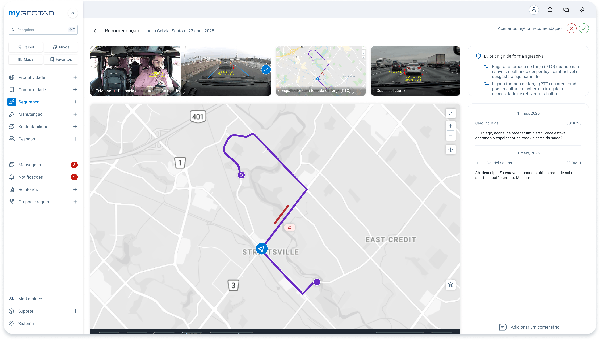

# Visual Direction — Complete Videotelemetry System

## Intent

FrotaK View should feel like a serious operations console: calm at rest, fast under pressure, information-rich without visual noise. The user-provided screenshot establishes the expected composition: a persistent navigation shell, a dominant map/evidence workspace, compact media previews and a contextual decision rail.

## What to preserve from the reference

- A narrow, light left sidebar with logo zone, collapse control, search, grouped navigation and badges.
- A thin topbar for global account, notification, communication and utility actions.
- A contextual header with back navigation, screen title, entity/date context and decisive actions.
- A horizontal evidence strip of camera frames, road footage and map/route thumbnails.
- A large central geospatial canvas with route, event markers, vehicle position and compact map controls.
- A right-side context rail for recommendation, event narrative, comments, review history and input.
- White and pale-gray surfaces, subtle strokes, restrained shadow, compact blue accents and semantic red/green decisions.
- Clear separation between global navigation, work context and the operational canvas.

## What must be original

- FrotaK View name, logo, icon treatment, wording and information architecture.
- Color token names and final brand palette.
- Screen composition details, spacing rhythm, button shape and content hierarchy.
- Maps, imagery, avatars, data, recommendations and domain copy.
- Navigation labels must follow the Smart Cameras capability model, not the reference product's menu.

## FrotaK personality

- **Operational:** every element supports monitoring, review, evidence, configuration or action.
- **Trustworthy:** provenance, timestamps, state, permissions and audit trail are visible.
- **Cinematic when needed:** video and map can become immersive without turning the whole product dark.
- **Precise:** dense tables and metrics align to a predictable grid.
- **Calm safety language:** severity is unmistakable but the interface is not permanently red.
- **Human-readable:** driver, asset and reviewer context stay close to technical telemetry.

## Visual anti-patterns

- giant marketing-style headings inside operational screens;
- cards nested inside cards without semantic reason;
- heavy shadows on every surface;
- permanent rainbow severity palettes;
- glassmorphism over video or maps that harms legibility;
- icon-only actions with no accessible name or tooltip;
- hiding timestamps, units, timezone, source or confidence;
- replacing data tables with decorative cards where comparison matters.

